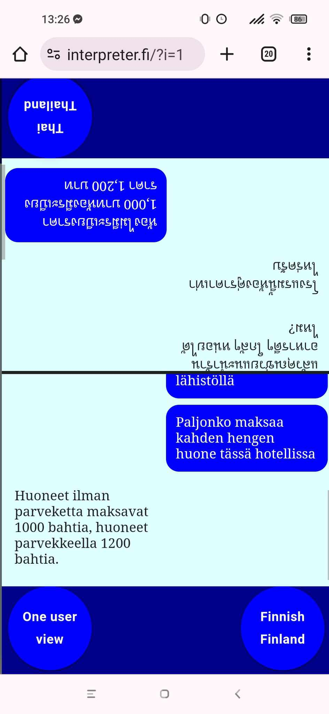

# interpreter.fi
This is my hobby programming project and by no means in ready state. It may or may not work at any given moment.

The app's main purpose is to work as an live interpreter between two persons talking in different languages. It utilizes speech recognition, translation and speech synthesis.

Speech recognition and synthesis are carried out by users's machine and thus the amount of supported languages varies based on the user's machine. It can be anything between a dozen and over a hundred. Translation is carried out by Google server which has the largest available selection of languages supported.

The app is programmed in React JS language.

The app has a registered domain https://interpreter.fi. It has not been published yet and is protected by login and password, which you can obtain from pennasenjari@gmail.com for demonstration purposes.

